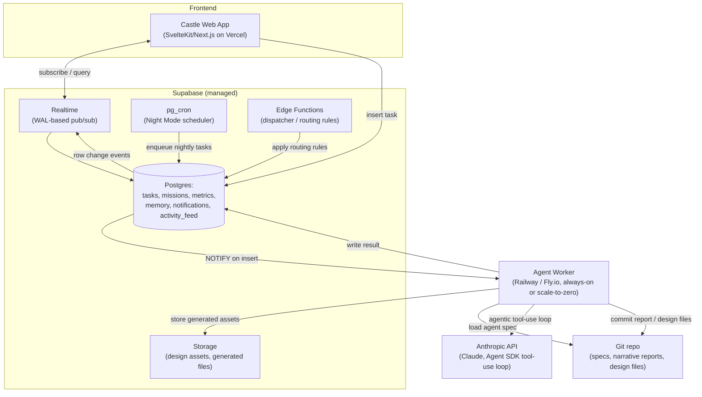
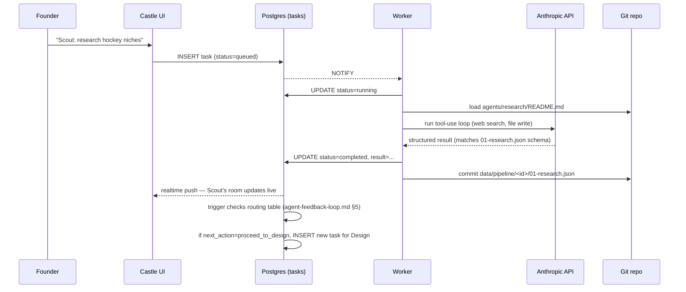
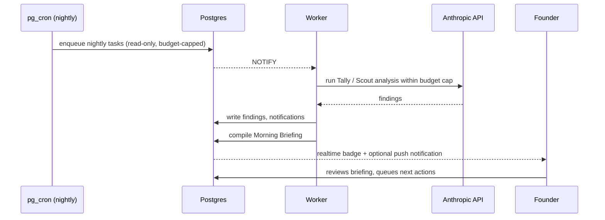

# AI-EMPIRE BACKEND — ARCHITECTURE BLUEPRINT

**Status:** Design only. Nothing in this document is built yet. This is the
plan for turning the file-based system + the castle (a read-only visual
layer over it) into a real, running, real-time operating system.

**The core claim this document has to earn:** every schema, every routing
rule, every agent spec already designed across this project — the pipeline
contracts in `docs/agent-feedback-loop.md`, the KPI/alert framework in
`agents/analyticsdir/`, the queue shape in `data/state/command-queue.json`
— was designed *as if* it were already talking to a real backend. This
isn't a rewrite. It's giving that design a real engine.

---

## 0. How this connects to what already exists

| Already built (files) | Becomes (backend) | Changes? |
|---|---|---|
| `agents/*/README.md` | System prompts loaded by the agent runtime | No — same content, new delivery mechanism |
| `data/state/command-queue.json` | `tasks` table | No — this file's schema *is* the table schema |
| `data/pipeline/*/0N-*.json` contracts | `tasks.payload` / `tasks.result` JSONB | No — same shape, now queryable instead of flat files |
| `docs/agent-feedback-loop.md` §5 verdict/routing table | Literal dispatcher logic | No — same rules, now code instead of a manual step |
| `agents/analyticsdir/kpi-and-alerts.md` alert levels | Notification-triggering thresholds | No — same 🔴🟡🟢🔵 scale everywhere |
| `data/metrics/*.json` | `metrics_snapshots` table | No — same fields, now a real time series |
| `reports/*/*.md` (weekly, war room, morning briefing) | Stays as git-committed markdown | **No — deliberately unchanged, see §0.1** |
| The castle (static artifact) | Becomes a real web app reading the DB | Yes — this is the one piece that gets rebuilt |

### 0.1 What deliberately does *not* move into a database

Narrative reports, agent specs, and design assets stay as **files in the
git repo**, not database rows. Two reasons: git history is already a free,
correct audit trail (nobody needs to build one), and keeping specs as
plain markdown means they stay readable, diffable, and editable by hand —
exactly the property that made every prior step of this project cheap.
Only things that genuinely need concurrency, live queries, or real-time
push (the queue, missions, metrics, memory, notifications, activity feed)
move into the database. This is a hybrid system on purpose, not a
compromise.

---

## 1. Empire Backend



### 1.1 Agent execution layer

An "agent" is not a persistent process. It's a **spec + a tool allowlist +
an output contract**, executed on demand by a worker. This matches how
Claude actually works (each call is a fresh context informed by retrieved
state) and avoids the mistake of trying to build long-running "agent
daemons" that would need their own process-supervision problem.

Per specialist, the execution layer needs three things, all of which
already exist or are already designed:

| Component | Source | Status |
|---|---|---|
| System prompt | `agents/<name>/README.md` | Scout, Tally exist; Design/Listing/Marketing need writing (unchanged gap from before) |
| Tool allowlist | New — see table below | To design |
| Output schema | `data/pipeline/README.md` | Already fully specified |

**Tool allowlists (proposed, scoped to least privilege):**

| Agent | Tools |
|---|---|
| Scout | Web search, write to `data/pipeline/*/01-research.json`, write to `data/marketplace-intel/discoveries.json` |
| Design | Read `designs/`, write `designs/` + `data/pipeline/*/02-design.json`, run the render-verified QA check |
| Listing | Read pricing docs, write `data/pipeline/*/03-listing.json`, (later) Etsy API for publish |
| Marketing | Read pricing/metrics, write `data/pipeline/*/04-marketing.json`, (later) ad platform APIs |
| Tally | Read `data/metrics/*`, write `reports/analytics/*`, write `data/pipeline/*/05-analytics-feedback.json` |
| Ember | Read everything, write `data/state/missions.json`, insert follow-up tasks — see §2.1 on when Ember needs an LLM call at all |

A worker execution = pick up a queued task → load spec + tool allowlist +
recent memory (§1.4) → run the Agent SDK's tool-running loop against
Claude → validate the output against the existing JSON schema → persist →
mark task complete → let the event system (§1.5) take it from there.

### 1.2 Task queue

**Recommendation: a Postgres table, not a message broker.** At this
volume — a handful of agent tasks per day, not a high-throughput stream —
Kafka/RabbitMQ/SQS is solving a problem this system doesn't have, at a
cost (money and operational attention) it doesn't need to pay. A `tasks`
table with a `status` column, combined with Postgres `LISTEN`/`NOTIFY`
(which Supabase Realtime is already built on) for near-instant pickup, is
the right-sized choice.

```
tasks
  id, raw_command, agent, status (queued|running|waiting|completed|failed),
  payload (jsonb), result (jsonb), queued_at, started_at, completed_at,
  dependencies (uuid[]), files_affected (text[]), created_by (founder|agent:<name>)
```

This is `data/state/command-queue.json`'s schema, unchanged, now a table.

### 1.3 Database

**Recommendation: Postgres via Supabase** (reasoning in §5). Core tables,
each mapping directly onto a file convention that already exists:

| Table | Maps from |
|---|---|
| `tasks` | `data/state/command-queue.json` |
| `missions` | `data/state/missions.json` |
| `metrics_snapshots` | `data/metrics/*.json` |
| `agent_memory` | New — see §1.4 |
| `notifications` | New, using `agents/analyticsdir/kpi-and-alerts.md`'s levels |
| `activity_feed` | New — derived, populated by triggers |
| `discoveries` | `data/marketplace-intel/discoveries.json` |
| `treasury` | `data/treasury/expenses.json` |
| `handoffs` | New — the sender/receiver/payload/outcome log already designed conceptually |

JSONB columns are used deliberately where the existing file schemas are
already flexible objects (`payload`, `result`, mission `note` fields) —
this avoids a rigid migration and lets the same shapes that already work
in JSON files work unchanged in the database.

### 1.4 Agent memory

A table, not a per-agent file, so it's queryable and so multiple agents
can read from a shared pool of institutional knowledge:

```
agent_memory
  id, agent, type (objective|lesson|pattern), content, confidence,
  source_task_id, created_at, superseded_by
```

Before executing, a worker retrieves: the agent's standing spec (always),
its current objectives (`type='objective'`, not superseded), and its most
relevant lessons (`type='lesson'`, ranked by recency/confidence). This is
the literal implementation of the never-built "Agent Training Hall" idea
from an earlier request — it turns out its natural home was always the
backend's memory table, not a castle room.

### 1.5 Event system

No separate event bus. **Database row changes are the events.** An
`INSERT`/`UPDATE` trigger on `tasks`, `missions`, `metrics_snapshots`, or
`discoveries` writes a row into `activity_feed` and, where the change
crosses a threshold from `agents/analyticsdir/kpi-and-alerts.md`, into
`notifications`. This is cheap, has no extra infrastructure, and is
exactly what Postgres logical replication (which Supabase Realtime
consumes) is designed to broadcast.

### 1.6 Real-time updates

Supabase Realtime subscribes clients to table changes over a WebSocket.
The castle UI opens one subscription per view (e.g., "tasks where
agent = Scout" while viewing Scout's room) and re-renders reactively on
each change — this is what makes "no page refresh" literally true, which
was structurally impossible for the static artifact version.

---

## 2. Agent Runtime



### 2.1 How Ember receives missions

Two paths, and they're handled differently on purpose:

1. **Founder-originated** — via the Command Console, now wired to a real
   `INSERT` instead of a copy-paste string. No LLM call needed to receive
   it; it's just a row.
2. **Agent-originated (routing)** — when a task completes with a verdict
   (winner / underperforming / failing), `docs/agent-feedback-loop.md`
   §5's routing table is **already a complete decision procedure**. It
   doesn't need an LLM to re-derive it each time — it's implemented as a
   deterministic Edge Function that reads the verdict and `likely_cause`
   and inserts the correct follow-up task. Ember only needs a real Claude
   call for the genuinely open-ended parts: writing the strategic
   narrative in a report, or handling a verdict that doesn't cleanly match
   the routing table (`likely_cause: unclear`). This split matters for
   cost and reliability — mechanical dispatch shouldn't cost an API call
   or be vulnerable to an LLM misreading its own rules.

### 2.2 How specialist agents execute tasks

Exactly the flow in §1.1 and the diagram above: pick up → load spec +
memory → run within the tool allowlist → validate output against the
existing schema → persist → mark complete. The QA gate already defined
for Design (render-verified safe-zone check) is enforced the same way it
was designed to be — as a required stage the task can't pass without,
not an optional habit.

### 2.3 How agents communicate

**Never directly.** No agent calls another agent or holds a conversation
with one. All communication is mediated through the database — one
agent's `result` becomes the next task's `payload`, exactly like the file
handoffs already designed in the pipeline (`01-research.json` feeds
Design's task the same way it always fed Design's *file*). This is a
deliberate reliability choice: every handoff is a durable, inspectable
row with a timestamp, not an ephemeral exchange that vanishes if
something crashes mid-conversation. The "Recent Handoffs" panel already
built into the castle's Throne Room is a preview of exactly this — it'll
have real, continuously-arriving data instead of two backfilled entries.

### 2.4 Where results are stored

- Structured facts (missions, metrics, queue state) → Postgres.
- Narrative reports (weekly, war room, morning briefing) → committed as
  markdown to the git repo, same as today, with a DB row pointing to the
  file path so the UI can list/query them.
- Design assets, generated images → Supabase Storage, referenced by path
  in the relevant task's `result`.

---

## 3. Real-Time Communication

| Need | Mechanism |
|---|---|
| UI updates | Client-side Realtime subscription per view; re-render on row change |
| Agent status changes | A room's "status" is literally `tasks.status` for that agent's most recent row — live, not cached |
| Notifications | `notifications` table + Realtime subscription + badge count; optional layer: push via email (Resend) or browser push for "notify me even when I'm not looking" |
| Activity feed | `activity_feed` table, populated by triggers, subscribed the same way |

Filtering (by agent, business, priority, date — all already designed in
the castle's Activity Feed view) becomes a real SQL query instead of a
client-side `.filter()` over a hardcoded array — same UI, real data
underneath.

---

## 4. Night Mode System



### 4.1 Scheduled agent cycles

`pg_cron` (built into Supabase) fires on a schedule (e.g., 2am) and
enqueues a **fixed, small set of routine tasks** — not an open-ended
"agents decide what to do overnight." Example nightly set: "Tally: check
alert conditions across all tracked businesses," "Scout: scan for new
discoveries" (only once a real external data source is wired in — see
dependency note below), "Ember: compile the Morning Briefing from
whatever ran."

### 4.2 What overnight analysis is allowed to do

**Read and report only, at first.** No autonomous listing changes, no
autonomous ad spend, no autonomous pricing changes — this directly
continues Ember's existing Decision Rules (test before scaling, never
spend without evidence) into the automated layer instead of quietly
relaxing them the moment a human isn't watching. Bounded, explicitly
opted-in autonomous *actions* (not just analysis) are a later, separate
decision per business action type — see §4.4.

**Dependency flag:** "scan for new discoveries/trends" requires a real
external data source (web search, a trends API, Etsy Stats access) — this
is the one place Night Mode's value depends on wiring up outside data,
not just re-reading the empire's own files. Worth sequencing after the
core loop is proven, not before.

### 4.3 Morning intelligence report generation

The last task in the nightly chain compiles the Morning Briefing (format
already fully specified in `agents/analyticsdir/` and the castle's Night
Mode view) from everything the night's tasks produced, writes it to
`reports/morning-briefing/`, and inserts a row the UI surfaces the moment
the founder opens the castle — or pushes as a notification so they don't
have to go looking.

### 4.4 Safety and budget governance

Real scheduled execution means real, unsupervised API spend. Non-optional
guardrails:

- **A hard budget cap per night** (e.g., a token/dollar ceiling); the
  worker stops enqueuing further tasks once hit, and logs that it did.
- **A kill switch** — one row/flag that disables the nightly cron
  instantly, checked before every run.
- **Dry-run mode by default** for any new task type until it's been
  manually reviewed a few times — same "prove it before automating"
  principle applied throughout every prior phase of this project.
- **No task type that touches money or a live listing runs
  unattended, ever**, without a separate, explicit, later decision — this
  is a governance line, not a technical limitation, and it should stay a
  deliberate wall.

---

## 5. Technology Recommendation

**For a solo founder who wants low cost, real scalability, a beautiful
UI, and genuine AI execution — not a team, not ops overhead:**

| Layer | Recommendation | Why |
|---|---|---|
| Database + Realtime + Cron + Storage + Auth | **Supabase** (managed Postgres) | One platform covers five things (DB, pub/sub, scheduled jobs, blob storage, auth) that would otherwise be five separate vendors to wire together and pay for. Free tier covers solo-founder scale; Pro tier is $25/mo when outgrown. Postgres's relational + JSONB model maps directly onto schemas already designed. |
| Task queue | **Postgres table + LISTEN/NOTIFY** (part of Supabase, not a separate service) | Task volume here is a handful per day, not a stream. A dedicated broker (Kafka/RabbitMQ/SQS) solves a scale problem this system doesn't have. |
| Agent execution worker | **Small dedicated service on Railway or Fly.io** (~$5–7/mo) | Agentic tool-use loops (especially research-heavy ones) can run minutes, which fights serverless timeout limits. A small always-on/scale-to-zero container is a better process model than trying to cram this into short-lived edge functions. |
| Agent model calls | **Anthropic API directly, via the Agent SDK's tool-running loop** | Already the model powering every agent spec written so far; the Agent SDK's tool loop is purpose-built for exactly this "agent with a bounded toolset, runs until done" pattern. |
| Frontend | **SvelteKit** (or Next.js if a bigger ecosystem/easier-to-hire-help-later matters more) on **Vercel** | Small bundle, clean integration with Supabase's realtime client, free tier deploy straight from git. The existing castle's plain-JS approach shows the UI itself doesn't need to be heavy — this just gives it real routing and real reactivity. |
| Specs, reports, design assets | **Stays in the git repo**, unchanged | No reason to move what already works; see §0.1. |

**Estimated fixed monthly cost:** $0–35 (Supabase free→Pro, worker
hosting, frontend hosting — all near-zero at this scale). **Variable
cost:** Anthropic API usage, which scales with how much real agent work
actually runs — this is the dominant cost, which is exactly why §4.4's
budget cap matters more than any infrastructure choice.

### Rejected alternatives, briefly

- **Firebase/Firestore** — comparable managed-backend convenience, but
  NoSQL is a worse fit for the relational, JSONB-friendly schemas already
  designed (missions, queue, metrics all have real structure worth
  querying).
- **Self-hosted Postgres + custom WebSocket server on a VPS** — lower
  dollar cost, higher *time* cost (ops, patching, uptime babysitting) —
  which is a real cost for a solo founder even when it doesn't show up on
  a bill.
- **Full AWS stack (Lambda + SQS + RDS + AppSync)** — more moving parts,
  more services to configure and monitor, steeper learning curve, no
  capability this system actually needs that Supabase doesn't already
  cover. The kind of complexity `docs/system-upgrade-plan.md` already
  flagged as worth avoiding without clear justification.

---

## 6. Rollout — staged, not a rewrite

Consistent with how every prior piece of this project shipped (manual
first, automate what's proven):

1. **Phase 1 — Real backend, still human-triggered.** Stand up Supabase,
   migrate the existing JSON files into tables, rebuild the castle as a
   real app reading/writing them. The Command Console goes from
   "copy this into your next session" to an actual `INSERT` — still
   founder-initiated, but now genuinely real-time.
2. **Phase 2 — Night Mode, analysis-only.** Scheduled cycles, budget-
   capped, read/report only, per §4.2.
3. **Phase 3 — Bounded autonomous actions, opted in per action type.**
   Starting with the lowest-risk ones (e.g., auto-updating a mission's
   progress percentage) — never money or live-listing changes without a
   separate explicit decision.
4. **Phase 4 — Full routing automation.** The winner/underperforming/
   failing dispatch table in `docs/agent-feedback-loop.md` §5 runs for
   real, end to end, with the founder reviewing outcomes rather than
   manually routing every handoff.

Each phase is independently useful and independently stoppable — there's
no point where half-built infrastructure is worse than the current
file-based system, which keeps working the whole time this is built.
